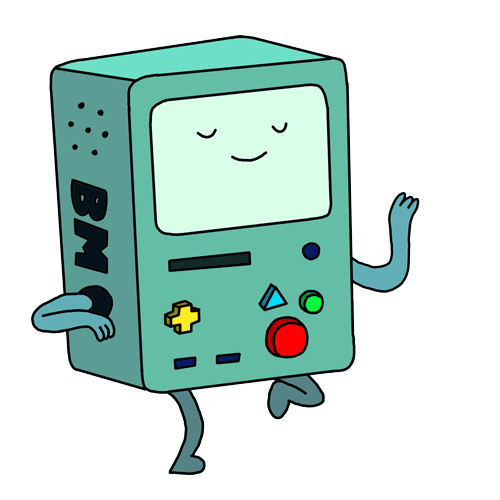

 

##  About Meee ❤
-  My name is **Akshita Singhal**
-  I'm a student of **B.Tech Computer Science** in **India**
-  I am interested in **Web Development** , **Machine Learning** and **Data Science**
- My favourite language for **DSA** and **general programming** is **C++**
- I like **drawing** and **painting** too.
-  I also lovee solving **sudokoss**
-  **Fun fact:** My *smartness* 💡 lies in my *laziness* 😴
- Ask me about programming in general, I am always
available to help and learn together.
 
<!--  
  ## My Skills :computer:

- **Programming Languages**
<table>
<tbody>
 <tr>
<td align="center" width="50%">
 
</td>

<td align="center" width="50%">
 
</td>

</tr>

</tbody>
</table>

- **Web Development**
<table>
<tbody>
 <tr>
<td align="center" width="33%">
 
</td>

<td align="center" width="33%">
 
</td>

<td align="center" width="33%">
 
</td>

</tr>

 <tr>
<td align="center" width="33%">
 
</td>

<td align="center" width="33%">
 
</td>

<td align="center" width="33%">
 
</td>

</tr>

</tbody>
</table>

## Currently Learning :beginner:

- **Data Science**

<table>
<tbody>
 <tr>
<td align="center" width="33%">
 
</td>

<td align="center" width="33%">
 
</td>

<td align="center" width="33%">
 
</td>
</tr>

</tbody>
</table>

- **Web Development**
<table>
<tbody>
 <tr>
<td align="center" width="100%">
 
</td>

</tr>

</tbody>
</table>

-->

 

## My GitHub Status :star:

<!--
## Want to know more?

 My Portfolio: [https://tanaytoshniwal.me](https://tanaytoshniwal.me) 

 

 

 

-->
 

## I am Open to Opportunities

